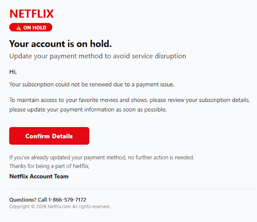

# SOC Incident Analysis: Netflix Credential Harvesting & Link-Based Phishing Campaign

---

| Field | Value |
| :--- | :--- |
| **Report ID** | SOC-2026-09-19-003 |
| **Analyst** | Adrián Steven Fajardo Liu |
| **Date of Analysis** | September 19, 2026 |
| **Incident Type** | Link-Based Phishing / Credential Harvesting / Anti-Analysis Evasion |
| **Classification** | Confidential / Threat Intelligence Analysis |
| **Severity** | High |
| **Status** | Completed – Threat Confirmed |

> **Template Note:** This documentation follows standard SOC L1/L2 incident reporting guidelines (Metadata → Executive Summary → Technical Evidence → Anti-Analysis Assessment → IOCs → Security Mapping → Remediation → References) optimized for GitHub rendering.

---

## 1. Executive Summary

A technical investigation was conducted on an email phishing campaign impersonating **Netflix Account Support**. The attack utilizes a high-urgency lure claiming that the target's subscription has been placed on hold due to a payment processing failure.

Forensic examination revealed a well-crafted social engineering message free of common grammatical errors, featuring both a malicious link (`Confirm Details`) and a secondary phone-based fallback vector (`1-866-579-7172`). Analysis of the target infrastructure confirmed the use of **Sandbox Evasion / HTTP Cloaking techniques**; the attacker's server returns an `HTTP 404 Not Found` status code to automated security scanners (yielding `0/90` Clean detections on VirusTotal) while maintaining active credential harvesting capabilities against legitimate user endpoints. Live dynamic testing via an isolated Ubuntu endpoint using Tor Browser verified that anti-anonymization and exit-node filtering are active on the threat host.

---

## 2. Incident Overview & Attack Vector

| Attribute | Details |
| :--- | :--- |
| **Impersonated Brand** | Netflix Inc. |
| **Sender Address** | `updates@macallan.chillhivecrest.info` |
| **Sender Domain** | `chillhivecrest.info` |
| **Phishing Pretext** | Account Renewal / Payment Declined Alert (`ON HOLD`) |
| **Primary Vector** | Email (SMTP) → Embedded Hyperlink / Secondary Vishing Support Hotline |
| **Target URL** | `https://jmlongrun.net/354341` |
| **VirusTotal Status** | `HTTP 404` / `0/90 Detections` (Anti-Analysis / Cloaking) |
| **Attacker Objective** | Netflix Account Credential Harvesting & PCI/Credit Card Exfiltration |

---

## 3. Technical Evidence & Forensic Investigation

### Step 1: Phishing Email Lure & Social Engineering Quality

* **Procedure:** Analyzing email layout, branding alignment, language quality, and embedded call-to-action (CTA) elements.
* **Analysis:** 
  * **Visual High Fidelity:** The email utilizes official Netflix red-and-black color schemes, crisp branding logos, and an `ON HOLD` status badge.
  * **Linguistic Professionalism:** The message body is grammatically correct and persuasive (*"Update your payment method to avoid service disruption"*), significantly increasing the likelihood of user compliance compared to lower-quality scam templates.
  * **Dual Vector Delivery:** Features a primary CTA button (`Confirm Details`) pointing to `https://jmlongrun.net/354341`, alongside a secondary support phone line (`1-866-579-7172`).

---

### Step 2: Target Link & Automated Sandbox Evasion (VirusTotal Analysis)

* **Procedure:** Inspecting the target URL (`https://jmlongrun.net/354341`) across threat intelligence sandboxes.
* **Analysis:**
  * **Response Status:** The network transaction log indicates an `HTTP 404 Not Found` response code during automated inspection.
  * **Evasion Mechanism:** Threat actors configure edge servers to drop or reject requests originating from known security vendor IP ranges or headless crawler User-Agents.
  * **Security Vendor Consensus:** All 90 security engines flagged the URL as `Clean` due to the cloaked `404` response, demonstrating a zero-day evasion technique designed to bypass automated Secure Email Gateways (SEGs).

---

### Step 3: Sender Infrastructure & DNS Health Check (MXToolbox)

* **Procedure:** Performing DNS diagnostic and MX record checks on the sender domain (`chillhivecrest.info`).
* **Analysis:**
  * **Domain Health Errors:** MXToolbox diagnostics revealed critical errors, including unresolvable HTTP host records (`http://chillhivecrest.info`), missing brand logos, and invalid SOA serial number formatting.
  * **Domain Hijacking / Rogue Relay:** The sub-domain `macallan.chillhivecrest.info` is used as an unauthorized outbound mail relay to send spoofed notifications without proper DMARC enforcement.

---

### Step 4: Isolated Dynamic Inspection via Tor Browser (Ubuntu Endpoint)

* **Procedure:** Installation of `torbrowser-launcher` on an Ubuntu Linux endpoint to safely execute anonymous live inspection of the target URL (`https://jmlongrun.net/354341`) without exposing the analyst's real IP or geographic location.
* **Environment Setup:**
  * Package installation performed using `sudo apt install torbrowser-launcher -y`.
  * Automated GPG cryptographic signature verification and package extraction completed for Tor Browser (`v15.0.23`).
  * Proxy verification confirmed active Tor routing via exit relay IP `185.220.100.252`.
* **Forensic Observations:**
  * Direct HTTP request to `https://jmlongrun.net/354341` via the Tor network resulted in a standard `404 Not Found` server error page.
  * **Threat Intel Conclusion:** The threat infrastructure employs **Anti-Tor Cloaking / Exit Node Filtering**, explicitly dropping or spoofing 404 responses for requests originating from anonymized networks to evade SOC threat hunting.

---

## 4. Indicators of Compromise (IOCs)

| IOC Type | Indicator Value | Context / Threat Description |
| :--- | :--- | :--- |
| **Sender Email** | `updates@macallan.chillhivecrest.info` | Envelope sender address |
| **Sender Domain** | `chillhivecrest.info` | Infrastructure hosting unauthorized mail relay |
| **Target Phishing URL**| `https://jmlongrun.net/354341` | Cloaked credential harvesting endpoint |
| **Favicon Path** | `https://jmlongrun.net/favicon.ico` | Asset resource request path |
| **Fallback Phone #** | `1-866-579-7172` | Secondary vishing hotline embedded in email footer |
| **Exit Relay IP Tested**| `185.220.100.252` | Tor exit node IP used during endpoint testing |
| **Impersonated Entity**| Netflix Inc. | Target brand |

---

## 5. Security Framework Alignment

### MITRE ATT&CK Mapping

| Tactic | Technique ID | Technique Name | Description |
| :--- | :--- | :--- | :--- |
| **Resource Development** | `T1583.001` | Acquire Infrastructure: Domains | Registration/use of rogue domain `chillhivecrest.info` |
| **Initial Access** | `T1566.002` | Spearphishing Link | Delivery of targeted email containing malicious URL |
| **Defense Evasion** | `T1497.001` | Virtualization/Sandbox Evasion: User Activity | Server-side HTTP 404 cloaking against automated scanners and Tor exit nodes |
| **Credential Access** | `T1056.003` | Input Capture: Web Portal | Deployment of rogue portal for credential harvesting |

---

### ISO/IEC 27001:2022 Control Alignment

* **A.5.10 (Acceptable use of information and assets):** Policies restricting interaction with unverified external billing alerts.
* **A.8.12 (Data leakage prevention):** Endpoint controls preventing personal/corporate credential entry into non-approved external domains.
* **A.8.20 (Network security):** Automated blocking of newly observed domains at the perimeter firewall and Secure Web Gateway (SWG).
* **A.8.23 (Web filtering / Email security):** Implementation of dynamic web filtering capable of detecting IP cloaking and anti-analysis behaviors.

---

## 6. Root Cause Analysis & Mitigation Plan

### Root Cause
An external threat actor delivered a highly convincing brand impersonation email using compromised or newly registered relay infrastructure (`chillhivecrest.info`). The email bypassed traditional automated URL scanners by serving an `HTTP 404` status code to automated analysis engines and Tor exit nodes while preserving the lure for human targets on conventional Residential/Corporate IPs.

### Recommended SOC Mitigation Actions

1. **Perimeter & SWG Blocking:**
   * Blacklist sender domain `chillhivecrest.info` and destination domain `jmlongrun.net` across firewalls, DNS sinkholes, and Secure Web Gateways.
   * Implement URL filtering rules that inspect target domains for HTTP status cloaking or dynamic redirects.

2. **Email Security Gateway (SEG) Rules:**
   * Create custom regex detection rules blocking incoming emails containing the domain `chillhivecrest.info` or display names impersonating "Netflix".
   * Quarantine emails failing SPF/DKIM alignment from `.info` top-level domains.

3. **User Awareness Training:**
   * Alert organizational users to the existence of convincing phishing emails without grammatical errors.
   * Reiterate standard protocol: always navigate directly to `netflix.com` via browser bookmarks rather than clicking links inside email alerts.

---

## 7. References

* **Netflix Security Help Center:** *Recognizing Phishing Emails and Suspicious Messages*
* **VirusTotal Intelligence API:** *URL Transaction Log & Behavior Analysis*
* **MITRE ATT&CK Framework:** [https://attack.mitre.org](https://attack.mitre.org)
* **ISO/IEC 27001:2022:** *Information security, cybersecurity and privacy protection — Security controls.*
